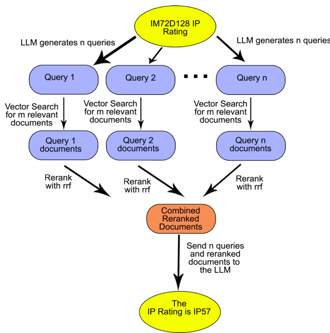

# RAG-FUSION: A NEW TAKE ON RETRIEVAL-AUGMENTED GENERATION  

Zackary Rackauckas Infineon Technologies San Jose, CA zackary.rackauckas@infineon.com  

# ABSTRACT  

Infineon has identified a need for engineers, account managers, and customers to rapidly obtain product information. This problem is traditionally addressed with retrieval-augmented generation (RAG)chatbots, but in this study, I evaluated the use of the newly popularized RAG-Fusion method. RAG-Fusion combines RAG and reciprocal rank fusion (RRF) by generating multiple queries, reranking them with reciprocal scores and fusing the documents and scores. Through manually evaluating answers on accuracy, relevance, and comprehensiveness, I found that RAG-Fusion was able to provide accurate and comprehensive answers due to the generated queries contextualizing the original query from various perspectives. However, some answers strayed offtopic when the generated queries' relevance to the original query is insufficient. This research marks significant progress in artificial intelligence (AI) and natural language processing (NLP) applications and demonstrates transformations in a global and multi-industry context.  

Keywords Chatbot $\cdot\cdot$ Retrieval-augmented generation $\mathbf{\nabla}\cdot\mathbf{\varepsilon}$ Reciprocal rank fusion $\mathbf{\nabla}\cdot\mathbf{\varepsilon}$ natural language processing  

# Introduction  

Infineon account managers and field application engineers have expressed the need to obtain sales-oriented product informationrapidly,butInfineon's product selection guidesand datashees areoften hundredsof pages long.Born from this needwas therapid development of chatbots to provide account managers and engineers with technicalinformation in seconds.These chatbots are built off the state-of-the-art retrieval-augmented generation framework.  

Recently,retrieval-augmented generation (RAG)has been at thecore of allof Infineon'svirtualasistants.Retrievalaugmented generation answers auser's questions related tothepurpose of the virtualasistant.The method combines text generation from large language models (LLMs)and document retrieval from databases of related documents to generate accurate,relevant, and comprehensive responses.(Yu 2022) Large language models are advanced natural language processing systems trained onlarge sets of data that process and generate text.While they are designed to handle tasksikemachinetranslation,summarization, andconversationalinteractions,RAG modelscan alsoleverage them for informationretrieval.[2]RAG has shownremarkable successinseveralknowledge-intensive naturallanguage processing tasks includingaccuratetriviaquestionanswering,highlyaccuratefact verification,andaccuratelyanswering middle school math questions.[3][4] In addition, retrieval-augmented generation reduces misinformation typically produced by large language models and non-RAG chatbots. [5]  

Document retrievalis a fundamentalcomponent of the algorithm.Traditional RAG virtual assistants rank documents in the order of relevance tothe query, usuallby vector distances.This means that the more relevant a document is in aquery,the higher priority it takes being in the answer.Recentlyhowever, developers and researchers have explored implementing diferent reranking methods for documents. It has been found that reranking in retrievalaugmented generation plays a significantrole inimproving retrieval resultsand in increasing the accuracy,relevance, and comprehensiveness of answers. [6]  

Reciprocalrank fusion (RRF)is a reranking algorithm that gives areciprocalrank to documents in multiple sources, then combines those ranks and documents into one finalreranked list. It has been found that RRF outperforms many other documentreranking methods while being sensitive to its parameters.[7][8] Utilizing RRFas areranker in a RAG algorithm yields RAG-Fusion, a novel RAG-based chatbot model popularized by Adrian H. Raudaschl. [9]  

The chatbot I developed in this paper was initiallya traditional RAG bot developed to be used by automotive field engineers.ButIfound that there was aneedforcustomers and distributors touse thischatbot as well from questions asked online in our developer community.[10] Accordingly,Ichanged the model of the chatbot fromRAG to RAGFusion withthehypothesis thatitwould provideanswers that not only heldthe same accuracyasthe RAGchatbot, but were also morecomprehensive inaddressng various perspectives ofusers'questions.Thus,Itestedthebotfor viability in the following threeareas:answering product-specificquestions from enginees, answering sales teams'queries about sales strategies,and answeringcustomer queriesabout products.Specificaly,Ifocused on answering questions related to our silicon MEMs microphones and metal-oxide-semiconductor field-efect transistors (MOSFETs).[11] [12]  

# RAG vs RAG-Fusion  

The traditionalretrieval-augmented generationchatbot modelfor specificproduct informationconsists of the following steps:  

·Gather product documents (e.g., datasheets, and product selection guides) in a database of documents for retrieval into text.   
·Create vector embeddings-numericalrepresentations of the textthatthe algorithm can understand-and store them in a vector database.  

Upon receiving a query from the user,  

· Retrieve the $n$ most relevant documents based on vector distance to the original query via vector search. ·Send the query together with the retrieved documents to a large language model to generate a response anc output the response.  

RAG-Fusion,on theother hand,hasafewextra steps.[13]Once the originalquery isreceived,the model sends the original query tothelarge language modelto generate anumber of new searchqueries basedontheoriginal query.For example,if the user's original query is"Tell me about MEMs microphones," the generated queries may include  

· What are MEMs microphones and how do they work? . What are the advantages of using MEMs microphones? · What are some recommended MEMs microphones?  

The algorithm then performs vector search tofind a number of relevant documents like with RAG.But,instead of sending those documents with the queries to the large language model to generate the output, the model performs reciprocalrank fusion. Reciprocal rank fusion is an algorithm commonly used in search to assign scores to every document and rerank them according to the scores.The scores assigned to each document, orrrf scores,are  

$$
{\mathrm{rrfscore}}={\frac{1}{{\mathrm{rank}}+k}}
$$  

where rank is the current rank of the documents sorted by distance, and $k$ is a constant smoothing factor that determines the weight given totheexistingranks.Upon eachcalculation of the score,therf score is accumulated with previous scores for the same document, and when allscores are accumulated, documents are fused together and reranked according totheir scores.The modelthen sends thererankedresults along with the generated queries and the original queries to the large language model to produce an output.  

  
Figure 1: Diagram ilustrating the high levelprocess of RAG-Fusion starting with the original query"IM72D128 IP Rating"  

# Infineon Chatbot for Engineers  

There are three potential use cases of theInfineon RAG-Fusion chatbot: providing technical information to engineers, providing sales-oriented information to account managers,and providing customer-facing information tocustomers.  

To test theviabilityofthechatbot in providing information toenginers,Igatheredalistof technical questions from Infineon's developer communityforum regarding our products.[1o]Ithenoptimized the questions to produce the best output with the RAG-Fusion.This included correcting spelling and grammar,converting statements into questions,and dividing multi-part questions intoasingle query.Ithencomparedtheaccuracy of theRAG-Fusionchatbot inanswering the technical questionsagainst thecorrect forumsolutions providedby Infineon experts.Take the following question for example.  

Query: IP rating of mounted IM72D128  

Generated queries: ['1. What is the IP rating of the mounted IM72D128?','2. IP rating explained for mounted IM72D128.','3. Waterproofing capabilities of the IM72D128 with its IP rating.','4. How does the IP rating of the IM72D128 affect its durability when mounted?"]  

Bot answer: The mounted IM72D128 has an IP57 rating, indicating a high level of protection against both dust and water.The first digit, 5, signifies its resistance to solid objects like dust or dirt. The second digit, 7, represents its resistance to water. This rating means that the IM72D128 has a sealed design, preventing water or dust from entering between the membrane and backplate. This robust design ensures no mechanical blockages or electric leakage issues typically seen in MEMS microphones. As a result, the IM72Di28 is highly durable and can withstand exposure to water and dust without significant damage. Its sealed MEMS design allows it to function properly even in challenging environmental conditions, providing long-term durability and reliable performance.  

Forum solution: Yes, you are right. IM72D128 has IP57 rating. The recommended Reflow soldering and board assembly of the microphone is given in section 7 (page: 14-15) of the datasheet. Please also refer to the application note: MEMS microphone mechanical & acoustical implementation.  

In this case,thechatbot providedacorrect answer, that the IM72D128microphone hasanIP57rating.Unlike the forum solution,however,thechatbot notonly provided therating,butalsoexplained whattheratingsignifies.Inaddition, it provied information about the microphone'ssealed design,ensuring no mechanical blockage or electric leakage issues,andafinal statementsummarizing its strengths.This extrainformation was derived fromthe generated queries and provided an answerthat wasnotonlycorrect, but also more comprehensive and had more context surrounding the question comparedto the forum solution.The only part missingfrom the answer is thatthe microphone delivers high  

ingressIP57 protection at a microphonelevelbecause of Infineon's latest Sealed Dual Membrane MEMS technology.   
This missing part may be solved, however,byincreasing the number of queries generated or documents retrieved.  

In addition to technicalproduct questions, many engineers also ask forhelptroubleshooting or product instructions. The bot,however, tends to answer these questions with very general instructions andby indicating the user should follow up with Infineon. The following query highlights this tendency.  

How to connect and communicate with the PDM interface of IM69D130 with stm32  

The bot lists six steps,five of which are mainly general guidance, with one step matching the expert solution:  

Bot: Configure the PDM interface settings on the STM32 microcontroller according to the requirements of the IM69D130, including clock frequency, data format, and other parameters. Forum: Set up the data format on the I2S interface to match the PDM data from the IM69D130.  

However,theforum answer emphasizes that the IS2 interfaceof themicrocontroller must be in slave receive mode. which is nowhere tobe found inthe bot'sanswer.This ismostikely because the productdatabasedoesnotcontain this kind of guidance.Noneof the documents mention slave receiver mode, whichis a keyword inthe response.Since it is unable toretrieve this information,thelanguagemodelmakes upforthis byoutputingits priorknowledge tosupplement the missing information fromthe documents, which are general troubleshooting steps and not product-specific steps. This tendencycan be solved by providing correct documentation inthedatabase regarding troubleshooting and methods to use the product.  

# Infineon Chatbot for Account Managers  

Although its original purpose wasto be used for enginees,the bot endedup performing the best in response to sales-oriented questions.These are questions that are asked byaccount managers orinside salesrepresentatives that give insight into the benefits of Infineon products and sales strategies.  

To devise sales strategies,the botretrieves the documents relatedtothe specificproducts,in the folowing caseour 100V Linear Field-effectTransistor(FET).It then synthesizes the product knowledge with logic fromthelargelanguage model to create a valuable strategy based on accurate product information.Generating multiple queries is key to devising a comprehensive and multiperspective sales strategy. For example, in response to the prompt  

How do I sella 10oV OptiMOS Linear FET for power over ethernet to my customer?  

the bot generates unique promptsaddressng markettrends andcustomer preferences,best practicesforselling electrical components,thevaluepropositionofourLinear FET,and strategiesforeffectively pitchingthebenefits and featuresof our Linear FET.The answer generated bythechatbot addreses these queries by providing technical specifications such as thelatest IEEE 802.3bt standard increasing the available power via Power over Ethernet (PoE). It continues to highlight Infineon'sexpertise in switched-mode power supply designs and our FETs'high efficiency,protection, best-in-classperformance withultra-low RDS(on)and low charge,and high reliability. Itresponds that the value proposition includes improving efficiency and power density,low conduction losses,and highswitching performance leading to energy savings and better thermal management. For sales strategies, it suggests highlighting its value proposition, advantages in performance and eficiency, and the importance to understand customer-specific needs and requirements fortheir applications.It ends with suggesting the account manager provide technical support and assistance, which ties back into our Infineon chatbot use case for engineers.  

This sales-oriented question answering for account managers reduces the need for an account manager to ask an engineer for product information as wellas the engineer's need to sift through a10O-page datasheet.This save times foreveryone inthe processand increases the account manager'sabilityto sel the product, resulting in more sales and higher revenue.  

Inside sales representatives often needtoquickly find product-specific information.This issimilarto the use case for engineers,butinsteadoftechnicalinformationlikevoltageandcurrentdensity,itisinformationabout applications and product validation.  

Query: What is the application of IM73A135V01?  

Bot response: Based on the provided documents,the IM73A135V01 is a dust and water resistant analog XENSIVTM MEMS microphone with a best-in-class Signal to Noise Ratio (SNR) of 73dB(A) for high-quality audio pick-up. It also has a flat frequency response and low distortion. In addition, it is IP57 robust to dust and water. While the documents do not specifically mention application examples or industry applications for the IM73A135V01, it is a robust and high-performance MEMS microphone that can be used in various audio devices such as TWS earbuds and compact audio devices. Based on its features and benefits, it can be used in applications that require high-quality audio pick-up,low distortion, and dust/water resistance. Some potential applications could include consumer electronics, automotive, industrial, and smart devices.  

# Infineon Chatbot for Customers  

While thechatbot provides great support forsales teams,it is alsoable toprovidecomprehensive andhelpful feedback forcustomers"product-related questions.These are not engineering questions,butrather questions fromcustomers who are considering buying our products.Forexample,acustomer could belooking to manufacture acamera and wants to know whetherour microphones areagood fitfortheircamera.Infact, this wasareal question askedonour developer community. [10]  

Query: Is the IM72D128 microphone good to use in an outdoor surveillance camera?  

Bot response: The IM72D128V01 microphone is an ideal choice for outdoor surveillance cameras based on several documents. Document 1 states that it is IP57 dust and water resistant, making it able to withstand the conditions typically encountered in outdoor settings. Document 7 further describes it as an ultra-high-performance digital microphone with a high signal-to-noise ratio (SNR) and low distortions, which ensures clear and high-quality audio capture. This makes it well-suited for outdoor surveillance cameras that require excellent audio capture capabilities. Additionally, Document 8 mentions that the IM72D128VO1 microphone is designed for both indoor and outdoor automotive applications, offers best-in-class audio performance, and has an extended temperature range. These features can be advantageous for outdoor surveillance cameras as well emphasizing its suitability for capturing audio in outdoor environments.  

With this answer,the customer understands that our IM72Di28 microphone does align withtheir project, resulting ina higher chance of a new sale.  

# Benefits of a Chatbot  

Customers and engineers tendto ask several questions in one query,and Infineon experts tendtorespond to the main question and not the several smaller onesasked.Withachatbot, albeit in separate queries,userscan ask all their questions and get answers.  

In addition to product-specificknowledge,achatbot can leverage pretrained knowledge from its large language model that an Infineon expert may nothave.For example,one question asked by a customer was regarding whether MEMs microphones could be used in wooden instruments or professionalrecording studios.While our expert responded by pointing to theMEMs microphone product page and datasheets,the RAG-Fusion bot wasable toprovidea useful and comprehensive answer drawing on its prior trained knowledge and database of MEMs microphones.  

MEMS (Micro-Electro-Mechanical Systems) microphones are small devices that convert sound waves into electrical signals. They utilize a diaphragm that vibrates in response to sound waves and an acoustic sensor that detects these vibrations. The sensor then translates the vibrations into electrical signals, which can be amplified and processed for various applications.   
The advantages of using MEMS microphones in stage or professional studio recordings are significant. Their small size alows for easy integration into equipment and placement in different areas. They offer high-performance audio capture with low self-noise, wide dynamic range, and high sensitivity. MEMS microphones also provide excellent audio quality, enabling accurate and precise sound reproduction. Additionally, their compact design enables the creation of microphone arrays for noise cancellation and beamforming, enhancing audio capture in complex acoustic environments. However, when using MEMS microphones in wooden instruments on stage or in professional studio recordings, there may be limitations or challenges. One potential limitation is their sensitivity to handling noise, as MEMS microphones can be more sensitive to vibrations and movements compared to traditional microphones. This requires careful handling and mounting to minimize unwanted noise. Additionally, the frequency response of MEMS microphones may not perfectly match the tonal characteristics of wooden instruments, necessitating careful selection and placement to achieve the desired sound.  

To capture the sound of wooden instruments effectively, some recommended MEMS microphones include models like the Infineon-IM73D122 or the Infineon-IM72D128. These microphones offer high sensitivity, low self-noise, and a wide dynamic range, making them suitable for capturing the nuances and details of wooden instruments. However, it is important to experiment and select the microphone that best suits the specific instrument and desired sound.  

In summary, MEMS microphones can be used in wooden instruments on stage or in professional studio recordings, offering advantages such as small size, high audio quality, and the ability to capture details and nuances. However, careful consideration should be given to microphone selection, placement, and handling to overcome any potential limitations or challenges.  

# Challenges of RAG-Fusion  

The largest challenge of RAG-Fusion is the slow answer time from receiving the query to outputting the answer.I compared the runtime toour traditional RAG chatbot by performing ten back-to-backruns with the same query.I then subtractedthetime when the querywasreceived from the time theoutput was given todetermine thetime it took for that run.Back-to-backruns should control for APIs having diffrent response times at different times of the day.  

Table 1: Comparison of RAG-Fusion Time and RAG Time in Smart Speaker Runs   

<html><body><table><tr><td>Run</td><td>RAG-Fusion Time (s)</td><td>RAG Time (s)</td></tr><tr><td>1</td><td>42.72</td><td>30.48</td></tr><tr><td>2</td><td>32.05</td><td>32.93</td></tr><tr><td>3</td><td>12.85</td><td>25.94</td></tr><tr><td>4</td><td>42.78</td><td>16.70</td></tr><tr><td>5</td><td>36.58</td><td>11.89</td></tr><tr><td>6</td><td>45.99</td><td>10.62</td></tr><tr><td>7</td><td>34.92</td><td>17.58</td></tr><tr><td>8</td><td>35.56</td><td>14.42</td></tr><tr><td>9</td><td>37.55</td><td>28.21</td></tr><tr><td>10</td><td>25.19</td><td>6.44</td></tr><tr><td>Average</td><td>34.62</td><td>19.52</td></tr><tr><td colspan="3">Observation: RAG-Fusion takes 1.77 times longer.</td></tr></table></body></html>  

Although it ishardto generalize exact runtime numbers,thisaverage over tenback-to-backruns showsthatRAG-Fusion bot i almost certainly slower than theRAG bot.Inthis case, RAG's average runtime fromquery tooutput was 19.52 seconds,with RAG-Fusion being nearly 1.77times as slow withan average query tooutput time of 34.62 seconds. Moreover, this trend is evident in all individual runs but runs two and three.  

After performing severalruns withdiferentqueries and atdiffrenttimes,Ideterminedthatthe slownessofRAG-Fusion compared toRAGcan be mostlyatributed tothesecond APIcall to thelarge language model.Even inlong queries of 70 or more words,thecallto generate multiple queries never took morethan 5 seconds.The modelthen ran through document retrieval and reciprocal rank fusion almost instantly until it stopped for the second API callfor several seconds.The second APIcallscomplexity isamplifiedbythe volume anddiversityof the input inthe formof multiple queries and asubstantial number of documents in contrast tothe much simpler callin RAG with one query and fewer documents.Two ways toovercome this slowness included hosting an LLMlocally toreduce latency in the call to the LLM and decreasing the number of queries generated by the first API call.  

Anotherchallenge of RAG-Fusion is the inability to empirically evaluate answers.While evaluation frameworks like ROUGE,BLEU, BLEURT, and METEOR are often applied to assessthe accuracy of retrieval-augmented generation models,inthecaseoftheInfineonchatbot, there is not necessarilyadirectexpectedanswer.Thus,suchevaluation frameworks are less effective fortasks such as the sales and customer-oriented answering where outputs can vary significantly in structure and content while still being correct.  

New evaluation toolkits suchas RAGEloand Ragas have recentlyemerged.Such frameworksseek toprovide automated evaluation for RAG-based models.RAGElo takes inalistof questions,documents, and answers. It then assigns a tournament-style Elo ranking of multiple RAG pipelines over diferent queries and prompts [14].Ragas provides empirical assessment scores incontext precision,faithfulness, and answerrelevancy[15].Despite promisingresultson evaluating RAG-based agents,further tweaking tothese evaluation methods is needed toalign withthe unique goalsof the Infineon RAG-Fusion chatbot.  

The evaluation method that reflects RAG-Fusion's goals are human evaluations based on accuracy,relevance,and comprehensiveness.Ratingsfrom Infineon account managers and enginees providethebest insight into answer quality from an expert lens.For the purposes of this paper,however,I manually evaluated the responsesbased on the same scale.Ifound that RAG-Fusion excels in accuracy and comprehensivenessbut occasionally strays inrelevance.This occurs whenirelevantqueries are generated by thelargelanguage model. While the answers to the generated queries were accurate and comprehensive,they strayed fromthe intention of the original question if the generated query it answered differed too much from the intent of the original query.  

To achieve answers that completely match the intentionof the original query,users must sometimes engineer prompts to be more specific andcomprehensible sothat the large language model generates appropriate queries.An example questionfrom a distributor was regarding whether our IM72D128 microphone is good for them to use in a security camera:"IfitwasOkay,itisverygoodforut-dorsurveillncecamera"with"If itwasOkay"refering towhether water anddust come throughthe sound port.The firstpromptItried forthisquestionwas"Is IM72D128very good for an out-door surveillancecamera?"However,thelanguage modeldid notrecognizemyintentionof thephrase"goodfor" andthus generated prompts labeling IM72Dl28asa surveillncecameraitself.Iwas able to generaterelevant queries with IM72D128 understood to be a microphone used in a surveillance camera with the prompt"Is the IM72D128 microphone good touse in an outdoor surveillance camera?"Situations like this can beremedied by providing a prompt creationguide tousers,but inthelong runIwouldliketoinvestigate waystointegrate promptengineering into thebot side rather than forcing the burden on users.  

Anotherchallenge ofRAG-Fusion,which isalsoachallenge of RAG, is its inabilityto providedefinitively negative answers. Below is an example of when the bot could not find documents relating to the user's query.  

Query: We need to Confirm whether the IFX waterproof MIC has a Sleeping mode and wake-up functions   
Response: Based on the provided documents, it is uncertain whether the IFX waterproof MIC has sleeping mode and wake-up functions, as none of the documents explicitly mention these features. To obtain accurate information, it is recommended to refer to the official documentation or reach out to the manufacturer directly for confirmation.   
Forum solution: Our microphone does not come with sleep mode and wake up functionality. With respect power optimization, our microphone comes with low power mode.  

While the bot wascorrct that there is no mention ofsleeping mode and wake-up functions inthedatabase of product information,it did not provide afirmlynegative answer.Thisis because the nature of the bot iscentered around document retrieval and not providing clear negative answers.  

# Conclusion  

Ifound that the Infineon RAG-Fusion chatbot was able to provide more accurate and comprehensive answers than traditional RAG models.This includes answers for questions related to technical product information for engineers, sales strategies foraccount managers,andcustomer-oriented product explanations.This is due to the generation of multiple queries based on the original query, which alows the chatbot toanswer questions from multiple angles.In adition,usingRRFtorerankthedocumentsretrievedresults inthemostrelevant documents getingthehighest priority in answer generation.  

While RAG-Fusion increases answer quality,it comes with challnges such as a longer runtime than other models due to a more complexcal to the LLM with multiplequeries and more documents, answers going offtrack from the original querydue to irrelevant queriesgenerated bythe firstLLMcal,andtheoccasionalneed for appropriate prompt engineering to generate the desired outcome.  

Many questions asked on the developer forum were from customers and distributors in non-English speaking countries. When customers translate their original questions to English,some context may belost and thus,customers may not receivethe answers they wantfrom Infineon experts.This wasclear withthe previously discussed question regarding the usage of MEMs microphones in securitycameras.In the future,I willexpand the Infineon RAG-Fusion chatbotto answer in languages other than English, especially Japanese and Mandarin Chinese.  

I will also research ways to beter represent multimodalpdf datasheets as text forretrieval-augmented generation This willallow RAG-Fusion chatbots to retrieve answers from more granular text,resulting in a higher accuracyof specific product information andreduced hallucinationfrequency.Iwillevaluate andtweaksystematic frameworks like RAGElo and Ragas according to RAG-Fusion's accuracy and performance. Other future research includes optimizing methods to improve real-time performance optimization, automated qualityassurance, and integration into internal and external web platforms.  

# Acknowledgements  

The author would like to thank Brooks Felton, Cynthia Meah, and Christopher Arnold.  

# About the Author  

Zackary Rackauckas is an AI and business development research intern at Infineon Technologies,San Jose,United States.His current interests include multilingual NLP,generative AI,and digitization and decarbonization methods.He is a professonal member of IEEE Intellgent Systems. Zack received his BA in mathematics from Swarthmore College. Contact him at zackary.rackauckas @ infineon.com.  

# References  

[1]W.Yu,"Retrieval-augmented Generation acrossHeterogeneous Knowledge"inProceedingsofthe 2022Conference of the North American Chapter of the Association for Computational Linguistics: Human Language Technologies: Student Research Workshop, pp. 52-58, 2022, doi: 10.18653/v1/2022.naacl-srw.7   
[2] H. Naveed, U.A. Khan, S.Qiu, M.Saqib, S. Anwar, M. Usman,et al.,"A Comprehensive Overview of Large Language Models, 2023, doi: 10.48550/arXiv.2307.06435.   
[3] Z.Levonian, C.Li, W.Zhu, A.Gade, O.Henkel,M.Postle,et al.,"Retrieval-augmented Generation to Improve Math Question-Answering: Trade-offs Between Groundedness and Human Preference,"in NeurIPS'23 Workshop on Generative AI for Education, 2023, doi: 10.48550/arXiv.2310.03184.   
[4] P.Lewis,E.Perez, A.Piktus,F.Petroni, V.Karpukhin, N.Goyal, et al.,"Retrieval-Augmented Generation for Knowledge-Intensive NLP Tasks," in NeurIPS, 2020. doi: 10.48550/arXiv.2005.11401.   
[5]K.Shuster,S.Poff,M.Chen, D.Kiela,J.Weston,"Retrieval Augmentation ReducesHallcination in Conversation" 2021, doi: 10.48550/arXiv.2104.07567   
[6] M. Glass, G. Rossiello, M. F. M. Chowdhury, A. R. Naik, P. Cai, and A. Gliozzo, $\mathrm{{}^{,}R e^{2}G}$ : Retrieve, Rerank, Generate,"in NAACL, 2022, doi: 10.48550/arXiv.2207.06300   
[7]G. V.Cormack,C.L.A.Clarke, and,S.Buetcher,"Reciprocalrank fusion outperformscondorcet and individual rank learning methods,in SIGIR '09: Proceedings of the 32nd international ACM SIGIR conference on Research and development in information retrieval, pp.758-759, 2009, doi: 10.1145/1571941.1572114.   
[8]S.Bruch,S. Gai,and A.Ingber,"An Analysis of Fusion Functions for Hybrid Retrieval"ACM Transactions on Information Systems, vol. 42, no. 20, pp. 1-35, 2023, doi: 10.1145/3596512.   
[9] A.H. Raudaschl, "Forget RAG, the Future is RAG-Fusion," Towards Data Science, 2023.   
[10] "Infineon Developer Community," [Online]. Available: htps://community.infineon.com/.   
[11]"XENSIVTM-sensing the world Sensor solutions for automotive,industrial,consumer and IoT applications," [Online]. Available: https://www.infineon.com/cms/en/product/sensor/mems-microphones/.   
[12]"PowerMOSFET- Infineon Technologies[Online].Available:htps://www.infineon.com/cms/en/product/powerm   
[13] A. H. Raudaschl, GitHub - RAG-Fusion: The Next Frontier of Search Technology.[Online]. Available: https://github.com/Raudaschl/RAG-Fusion.   
[14]A.Camara, and F.R. Barrera, GitHub -RAGElo.[Online] Available: htps:/github.com/zetaalphavector/RAGElo.   
[15]S. Es, J. James, L.Espinosa-Anke, and S.Shockaert, (2O23)“RAGAS: Automated Evaluation of Retrieval Augmented Generation," doi: 10.48550/arXiv.2309.15217  