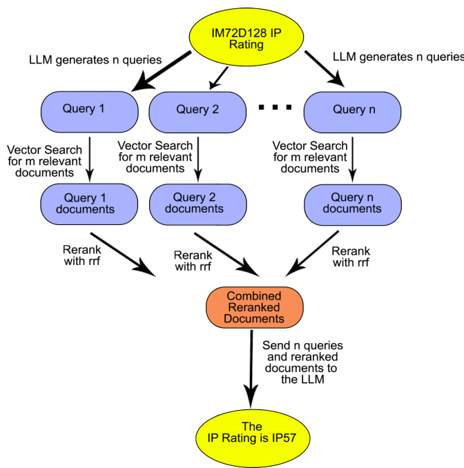

# RAG-FUSION：检索增强生成的新思路

Zackary Rackauckas Infineon Technologies San Jose, CA zackary.rackauckas@infineon.com

# 摘要

英飞凌已经确定工程师、客户经理和客户迅速获取产品信息的需求。传统上，这个问题是通过检索增强生成（RAG）聊天机器人来解决的，但在本研究中，我评估了新近流行的RAG-Fusion方法的使用。RAG-Fusion结合了RAG和互惠排序融合（RRF），通过生成多个查询，重新排名它们并融合文档和分数。通过手动评估答案的准确性、相关性和全面性，我发现RAG-Fusion能够提供准确和全面的答案，这是因为生成的查询从不同角度对原始查询进行了上下文化。然而，当生成的查询与原始查询的相关性不足时，一些答案会偏离主题。这项研究在人工智能（AI）和自然语言处理（NLP）应用方面取得了重要进展，并展示了全球和多行业背景下的变革。 Keywords Chatbot $\cdot\cdot$ Retrieval-augmented generation $\mathbf{\nabla}\cdot\mathbf{\varepsilon}$ Reciprocal rank fusion $\mathbf{\nabla}\cdot\mathbf{\varepsilon}$ natural language processing

# 导言

英飞凌的客户经理和现场应用工程师表示，他们需要快速获取面向销售的产品信息，但英飞凌的产品选择指南和数据表通常有数百页之长。基于这一需求，迅速开发了聊天机器人，以在几秒钟内为客户经理和工程师提供技术信息。这些聊天机器人是基于最先进的检索增强生成（RAG）框架构建的。

最近，检索增强生成（RAG）已成为英飞凌所有虚拟助手的核心。检索增强生成回答用户与虚拟助手目的相关的问题。该方法结合了大型语言模型（LLMs）的文本生成和相关文档数据库的文档检索，以生成准确、相关和全面的响应。（Yu 2022）大型语言模型是在大量数据集上训练的先进自然语言处理系统，用于处理和生成文本。虽然它们旨在处理机器翻译、摘要和会话交互等任务，但RAG模型也可以利用它们进行信息检索。RAG在准确的问答、高度准确的事实验证以及准确回答初中数学问题等多个知识密集型自然语言处理任务中表现出色。此外，检索增强生成减少了大型语言模型和非RAG聊天机器人通常产生的错误信息。

文档检索是该算法的基本组成部分。传统的RAG虚拟助手根据与查询相关性的顺序对文档进行排名，通常使用向量距离。这意味着文档在查询中越相关，它在答案中的优先级就越高。然而，最近开发人员和研究人员已经开始探索实施不同的文档重新排序方法。研究表明，在检索增强生成中重新排序在改善检索结果和提高答案的准确性、相关性和全面性方面起着重要作用。

互惠排名融合（RRF）是一种重新排序算法，为多个来源的文档赋予一个互惠排名，然后将这些排名和文档合并为一个最终的重新排序列表。研究发现，RRF在许多其他文档重新排序方法中表现更好，同时对其参数敏感。将RRF作为重新排序器应用于RAG算法会产生RAG-Fusion，这是一种由Adrian H. Raudaschl推广的基于RAG的新型聊天机器人模型。

本文中开发的聊天机器人最初是一种传统的RAG机器人，旨在供汽车领域工程师使用。但我发现，来自我们的开发者社区在线提出的问题显示出客户和分销商也有使用这个聊天机器人的需求。因此，我将聊天机器人的模型从RAG更改为RAG-Fusion，并假设这将提供的答案不仅具有与RAG聊天机器人相同的准确性，而且在处理用户问题的各种角度上更为全面。因此，我测试了该机器人在以下三个领域的可行性：回答工程师提出的与产品相关的问题，回答销售团队关于销售策略的查询，以及回答客户关于产品的查询。具体来说，我专注于回答与我们的硅MEMS麦克风和金属氧化物半导体场效应晶体管（MOSFETs）相关的问题。

# RAG对比RAG融合

传统的检索增强生成（RAG）聊天机器人模型用于获取特定产品信息，包括以下步骤：

- 收集产品文档（例如，数据表和产品选择指南）并将其检索到文本数据库中。
- 创建文本的向量嵌入-算法可以理解的文本的数值表示-并将其存储在向量数据库中。

当用户发送查询时，

- 通过向量搜索基于与原始查询的向量距离来检索 $n$ 个最相关文档。
- 将查询与检索到的文档一起发送到大型语言模型以生成响应并输出响应。

另一方面，RAG-Fusion模型有一些额外的步骤。一旦接收到原始查询，模型会将原始查询发送到大型语言模型以基于原始查询生成多个新的搜索查询。例如，如果用户的原始查询是“告诉我关于MEMs麦克风”，生成的查询可能包括

- MEMs麦克风是什么以及它们是如何工作的？
- 使用MEMs麦克风的优势是什么？
- 有哪些推荐的MEMs麦克风？

然后，算法执行向量搜索以找到一些相关文档，就像RAG一样。但是，与将这些文档与查询一起发送到大型语言模型以生成输出不同，该模型执行互惠排序融合。互惠排序融合是一种常用于搜索的算法，用于为每个文档分配分数并根据分数重新排名。分配给每个文档的分数，即RRF分数，是

$$ 
{\mathrm{rrfscore}}={\frac{1}{{\mathrm{rank}}+k}}
 $$

其中，排名是按距离排序的文档的当前排名， $k$  是一个常数平滑因子，确定给予现有排名的权重。在计算每个分数时，RF 分数与同一文档的先前分数累积，当所有分数都累积时，文档被融合在一起，并根据它们的分数重新排序。然后，模型将重新排序的结果连同生成的查询和原始查询发送到大型语言模型以生成输出。

*图1：展示了RAG-Fusion的高层流程图，从原始查询“IM72D128 IP等级”开始。*

# 英文标题翻译成中文：
1. 英飞凌工程师聊天机器人

英飞凌的RAG-Fusion聊天机器人有三种潜在的用例：向工程师提供技术信息，向客户经理提供销售导向信息，以及向客户提供面向客户的信息。

为了测试聊天机器人在向工程师提供信息方面的可行性，我从英飞凌的开发者社区论坛收集了关于我们产品的技术问题清单。然后，我对这些问题进行了优化，以便与RAG-Fusion结合产生最佳输出。这包括纠正拼写和语法错误，将陈述转换为问题，并将多部分问题分解为单个查询。然后，我比较了RAG-Fusion聊天机器人回答技术问题的准确性，与英飞凌专家提供的正确论坛解决方案进行了对比。举例如下问题。

查询：安装的IM72D128的IP等级

生成的查询：['1. 安装的IM72D128的IP等级是多少？', '2. 解释安装的IM72D128的IP等级。', '3. IM72D128的防水能力及其IP等级。', '4. IM72D128的IP等级在安装时如何影响其耐用性？']

机器人回答：安装的IM72D128具有IP57等级，表明对灰尘和水具有很高的防护级别。第一个数字5表示其对固体物体如灰尘或污垢的抵抗能力。第二个数字7代表其对水的抵抗能力。这一等级意味着IM72D128具有密封设计，防止水或灰尘进入膜片和背板之间。这种坚固的设计确保没有机械堵塞或电泄漏问题，通常在MEMS麦克风中见到。因此，IM72Di28非常耐用，可以在暴露于水和灰尘的情况下承受，而不会受到重大损坏。其密封的MEMS设计使其即使在恶劣的环境条件下也能正常运行，提供长期的耐用性和可靠的性能。

论坛解决方案：是的，你说得对。IM72D128具有IP57等级。麦克风的推荐回流焊和板组装在数据表的第7节（第14-15页）中给出。还请参考应用说明：MEMS麦克风机械和声学实现。

在这种情况下，聊天机器人提供了一个正确的答案，即IM72D128麦克风具有IP57评级。然而，与论坛解决方案不同，聊天机器人不仅提供了评级，还解释了评级的意义。此外，它提供了关于麦克风密封设计的信息，确保没有机械堵塞或电泄漏问题，并总结了其优势。这些额外信息源自生成的查询，提供了一个不仅正确而且更全面的答案，并且比论坛解决方案更具问题背景的上下文。答案中唯一缺失的部分是麦克风提供了高...

由于英飞凌最新的密封双膜MEMS技术，IM72D128麦克风在麦克风级别具有IP57防护等级。然而，这一缺失的部分可能通过增加生成的查询或检索的文档来解决。

除了技术产品问题，许多工程师还寻求故障排除或产品说明。然而，聊天机器人倾向于用非常一般的指导回答这些问题，并指示用户应该与英飞凌跟进。以下查询突显了这种倾向。

如何连接并与IM69D130的stm32的PDM接口通信

聊天机器人列出了六个步骤，其中五个主要是一般性指导，一个步骤与专家解决方案匹配：

机器人：根据IM69D130的要求，在STM32微控制器上配置PDM接口设置，包括时钟频率、数据格式和其他参数。 论坛：设置I2S接口上的数据格式，以匹配IM69D130的PDM数据。

然而，论坛答案强调了微控制器的I2S接口必须处于从机接收模式，而这在机器人的答案中找不到。这很可能是因为产品数据库中不包含这种指导。没有一个文档提到从机接收模式，这是答案中的关键词。由于无法检索到这些信息，语言模型通过输出其先前知识来补充文档中缺失的信息，这些信息是一般的故障排除步骤，而非产品特定的步骤。通过在数据库中提供关于故障排除和如何使用该产品的正确文档，可以解决这种倾向。

# 英文标题：Infineon Chatbot for Account Managers

中文翻译：英飞凌客户经理聊天机器人

尽管最初目的是为工程师提供服务，但该机器人最终在回答与销售有关的问题时表现最佳。这些问题通常由客户经理或内部销售代表提出，可以揭示英飞凌产品的优势和销售策略。

为了制定销售策略，该机器人检索与特定产品相关的文档，例如我们的100V线性场效应晶体管（FET）。然后，它将产品知识与大型语言模型的逻辑结合，基于准确的产品信息创建有价值的策略。生成多个查询是制定全面和多角度销售策略的关键。例如，针对以下提示：

如何向客户销售一款用于以太网供电的100V OptiMOS线性FET？

该机器人生成了独特的提示，涉及市场趋势和客户偏好、销售电子元件的最佳实践、我们线性FET的价值主张，以及有效推介我们线性FET的优势和特性的策略。该聊天机器人生成的答案通过提供技术规格，如最新的IEEE 802.3bt标准，增加通过以太网供电（PoE）提供的可用功率。它继续强调英飞凌在开关模式电源设计方面的专业知识，以及我们FET的高效率、保护、超低RDS(on)和低电荷、高可靠性等最佳性能。答案指出价值主张包括提高效率和功率密度、减少传导损失、高开关性能导致节能和更好的热管理。对于销售策略，建议突出其价值主张、性能和效率的优势，并重视了解客户特定的需求和应用场景。最后建议客户经理提供技术支持和协助，这与我们英飞凌工程师聊天机器人的使用案例相呼应。

这种面向销售的问题解答服务为客户经理减少了向工程师询问产品信息的需求，也减少了工程师需要筛选100页数据表的时间。这为整个流程中的每个人节省了时间，提高了客户经理销售产品的能力，从而带来更多销售和更高的收入。

内部销售代表经常需要快速查找特定产品信息。这类似于工程师的使用案例，但不同之处在于，它涉及应用和产品验证的信息，而不是像电压和电流密度这样的技术信息。

查询：IM73A135V01的应用是什么？

机器人回答：根据提供的文件，IM73A135V01是一款防尘防水的模拟XENSIVTM MEMS麦克风，具有73dB(A)的最佳信噪比，可实现高质量音频接收。它还具有平坦的频率响应和低失真。此外，它具有IP57级别的防尘防水性能。虽然文件没有明确提到IM73A135V01的应用示例或行业应用，但它是一款坚固且高性能的MEMS麦克风，可用于各种音频设备，如TWS耳机和紧凑型音频设备。基于其特点和优势，它可用于需要高质量音频接收、低失真和防尘防水性能的应用。一些潜在的应用包括消费电子、汽车、工业和智能设备。

# 英文标题：Infineon Chatbot for Customers

中文翻译：英飞凌客户聊天机器人

虽然聊天机器人为销售团队提供了极大支持，但它也能为客户的“与产品相关的问题提供全面和有用的反馈。这些问题不是工程问题，而是来自考虑购买我们产品的客户的问题。例如，客户可能正在考虑制造一台摄像机，并想知道我们的麦克风是否适合他们的摄像机。事实上，这是我们开发者社区上真实提出的一个问题。

查询：IM72D128麦克风是否适合户外监控摄像机使用？

机器人回复：根据多份文件，IM72D128V01麦克风是户外监控摄像机的理想选择。文件1指出，它具有IP57防尘防水等级，能够经受户外环境中通常遇到的条件。文件7进一步描述它为超高性能数字麦克风，具有高信噪比（SNR）和低失真，确保清晰高质量的音频采集。这使其非常适合需要出色音频捕获能力的户外监控摄像机。此外，文件8提到IM72D128VO1麦克风专为室内外汽车应用设计，提供最佳音频性能，并具有扩展的温度范围。这些特点对户外监控摄像机也有益处，强调了它在户外环境中捕捉音频的适用性。

通过这个回答，客户了解到我们的IM72Di28麦克风与他们的项目是一致的，从而提高了新销售的机会。

# 聊天机器人的益处

英飞凌的客户和工程师往往在一个查询中提出多个问题，而英飞凌的专家们倾向于回答主要问题，而不是提出的几个较小的问题。通过聊天机器人，尽管是在不同的查询中，用户可以提出所有问题并获得答案。

除了产品特定知识，聊天机器人还可以利用其庞大的语言模型预训练知识，这是英飞凌的专家可能没有的。例如，一个客户提出的一个问题是关于MEMs麦克风是否可以用于木制乐器或专业录音工作室。虽然我们的专家通过指向MEMs麦克风产品页面和数据表来回答，但RAG-Fusion机器人能够提供一份有用且全面的答案，利用其先前训练的知识和MEMs麦克风数据库。

MEMS（Micro-Electro-Mechanical Systems）麦克风是将声波转换为电信号的小型设备。它们利用一个随声波振动的振膜和一个检测这些振动的声学传感器。传感器将振动转换为电信号，可以放大和处理用于各种应用。

在舞台或专业录音工作室中使用MEMS麦克风的优势是显著的。它们的小尺寸使其易于集成到设备中并放置在不同区域。它们提供低自噪声、宽动态范围和高灵敏度的高性能音频捕获。MEMS麦克风还提供出色的音频质量，实现准确和精确的声音再现。此外，其紧凑设计可实现用于噪声消除和波束成形的麦克风阵列，增强复杂声学环境中的音频捕获。然而，在舞台上或专业录音工作室中使用MEMS麦克风时，可能存在限制或挑战。一个潜在的限制是它们对操作噪声的敏感性，因为与传统麦克风相比，MEMS麦克风对振动和移动更敏感。这需要小心处理和安装，以最大程度地减少不必要的噪音。此外，MEMS麦克风的频率响应可能无法完全匹配木制乐器的音色特性，因此需要仔细选择和放置以实现所需的声音效果。

为了有效捕捉木制乐器的声音，一些建议使用的MEMS（微电子机械系统）麦克风型号包括Infineon-IM73D122或Infineon-IM72D128。这些麦克风具有高灵敏度、低自噪声和宽动态范围，适合捕捉木制乐器的细微差异和细节。然而，重要的是要进行实验并选择最适合特定乐器和所需声音的麦克风。

总之，MEMS麦克风可用于舞台上或专业录音工作室中的木制乐器，具有诸如小尺寸、高音频质量和捕捉细节的能力等优势。然而，应仔细考虑麦克风的选择、放置和处理，以克服任何潜在的限制或挑战。

# RAG-Fusion的挑战

RAG-Fusion面临的最大挑战是从接收查询到输出答案的时间较慢。我通过执行十次连续运行相同查询来比较其运行时间与我们传统的RAG聊天机器人。然后，我从接收查询时的时间中减去输出给出的时间，以确定该运行所需的时间。连续运行应该控制API在一天中不同时间具有不同的响应时间。

<html><body><table><tr><td>Run</td><td>RAG-Fusion Time (s)</td><td>RAG Time (s)</td></tr><tr><td>1</td><td>42.72</td><td>30.48</td></tr><tr><td>2</td><td>32.05</td><td>32.93</td></tr><tr><td>3</td><td>12.85</td><td>25.94</td></tr><tr><td>4</td><td>42.78</td><td>16.70</td></tr><tr><td>5</td><td>36.58</td><td>11.89</td></tr><tr><td>6</td><td>45.99</td><td>10.62</td></tr><tr><td>7</td><td>34.92</td><td>17.58</td></tr><tr><td>8</td><td>35.56</td><td>14.42</td></tr><tr><td>9</td><td>37.55</td><td>28.21</td></tr><tr><td>10</td><td>25.19</td><td>6.44</td></tr><tr><td>Average</td><td>34.62</td><td>19.52</td></tr><tr><td colspan="3">Observation: RAG-Fusion takes 1.77 times longer.</td></tr></table></body></html>

*表1：智能音箱运行中RAG-Fusion时间和RAG时间的比较*

尽管很难概括准确的运行时间数据，但十次连续运行的平均值显示，RAG-Fusion机器人几乎肯定比RAG机器人慢。在这种情况下，RAG从查询到输出的平均运行时间为19.52秒，而RAG-Fusion则平均需要34.62秒，几乎慢了1.77倍。此外，这种趋势在所有单独运行中都明显，但在第二次和第三次运行中并未体现。

经过多次不同查询和不同时段的运行后，我发现与RAG相比，RAG-Fusion的缓慢主要归因于对大型语言模型的第二次API调用。即使在70个或更多单词的长查询中，生成多个查询的调用也从未超过5秒。然后，模型几乎立即运行文档检索和互惠排名融合，直到为第二次API调用停顿了几秒钟。与RAG中只有一个查询和较少文档的简单调用相比，第二次API调用的复杂性受到输入的量和多样性的放大，这些输入以多个查询和大量文档的形式呈现。克服这种缓慢的两种方法包括在本地托管LLM以减少对LLM的调用延迟，以及减少由第一个API调用生成的查询数量。

RAG-Fusion面临的另一个挑战是无法通过实证评估来评估答案。虽然诸如ROUGE、BLEU、BLEURT和METEOR之类的评估框架通常用于评估检索增强生成模型的准确性，但在英飞凌聊天机器人的情况下，并不一定存在直接的预期答案。因此，这些评估框架对于销售和面向客户的答复等任务效果较差，因为输出在结构和内容上可能存在显著差异，但仍然是正确的。

最近出现了新的评估工具包，如RAGElo和Ragas。这些框架旨在为基于RAG的模型提供自动化评估。RAGElo接受一组问题、文档和答案，然后为不同查询和提示的多个RAG管道分配类似锦标赛的Elo排名。Ragas提供了在上下文精度、忠实度和答案相关性方面的实证评分。尽管在评估基于RAG的代理方面取得了有希望的结果，但需要进一步调整这些评估方法，以使其与英飞凌RAG-Fusion聊天机器人的独特目标相一致。

反映RAG-Fusion目标的评估方法是基于准确性、相关性和全面性的人工评估。英飞凌的客户经理和工程师的评分为从专家视角评估答案质量提供了最佳见解。然而，出于本文的目的，我基于相同的评分标准对响应进行了手动评估。我发现，RAG-Fusion在准确性和全面性方面表现出色，但在相关性方面偶尔会有偏差。这种情况发生在大型语言模型生成了不相关的查询时。尽管生成的查询的答案准确且全面，但如果生成的查询与原始查询的意图差异太大，答案就会偏离原始问题的意图。

为了实现完全符合原始查询意图的答案，用户有时必须调整提示，使其更具体和易懂，以便大型语言模型生成适当的查询。一个分销商提出的问题是关于我们的IM72D128麦克风是否适合他们在安全摄像头中使用：“如果可以，它非常适合户外监控摄像头”，其中“如果可以”指的是声音孔是否会有水和灰尘进入。我为这个问题尝试的第一个提示是“IM72D128是否非常适合户外监控摄像头？”然而，语言模型没有理解我对“适合”的意图，因此生成了将IM72D128标记为监控摄像头本身的提示。我能够生成相关的查询，让IM72D128被理解为用于监控摄像头的麦克风，提示为“IM72D128麦克风在户外监控摄像头中使用好吗？”这样的情况可以通过为用户提供提示创建指南来解决，但从长远来看，我希望研究将提示工程整合到机器人端，而不是将负担强加给用户。

RAG-Fusion的另一个挑战，也是RAG的挑战之一，是其无法提供明确的否定答案。以下是一个示例，说明当机器人无法找到与用户查询相关的文档时的情况。

查询：我们需要确认IFX防水麦克风是否具有睡眠模式和唤醒功能
回复：根据提供的文档，无法确定IFX防水麦克风是否具有睡眠模式和唤醒功能，因为没有任何文档明确提到这些功能。为了获得准确信息，建议查阅官方文档或直接联系制造商以确认。
论坛解决方案：我们的麦克风不具备睡眠模式和唤醒功能。就功耗优化而言，我们的麦克风配备了低功耗模式。

虽然机器人正确指出产品信息数据库中未提及睡眠模式和唤醒功能，但它并未提供明确的否定答案。这是因为该机器人的性质是围绕文档检索，而非提供明确的否定答案。

# 结论

我发现英飞凌的RAG-Fusion聊天机器人能够比传统的RAG模型提供更准确和全面的答案。这包括工程师相关的技术产品信息问题、客户经理的销售策略以及面向客户的产品解释。这是因为基于原始查询生成多个查询，使得聊天机器人能够从多个角度回答问题。此外，使用RRF重新排名检索到的文档，确保最相关的文档在答案生成中获得最高优先级。

虽然RAG-Fusion提高了答案质量，但也带来了挑战，比如与其他模型相比更长的运行时间，这是由于与LLM相比具有更复杂的多个查询和更多文档，答案偏离原始查询由于第一个LLM生成的不相关查询，以及偶尔需要适当的提示工程来生成期望的结果。

在开发者论坛上提出的许多问题来自非英语国家的客户和分销商。当客户将原始问题翻译成英语时，可能会丢失一些上下文，因此客户可能无法从英飞凌专家那里获得他们想要的答案。这在先前讨论的有关在安全摄像头中使用MEMs麦克风的问题中是明显的。未来，我将扩展英飞凌的RAG-Fusion聊天机器人，以便用其他语言回答问题，特别是日语和普通话。

我还将研究更好地将多模式pdf数据表达为文本，以用于检索增强生成。这将使RAG-Fusion聊天机器人能够从更细粒度的文本中检索答案，从而提高特定产品信息的准确性，并减少幻觉频率。我将根据RAG-Fusion的准确性和性能评估和调整系统化框架，如RAGElo和Ragas。其他未来的研究包括优化方法，以改进实时性能优化、自动化质量保证，并将其整合到内部和外部网络平台中。

# 致谢

作者感谢Brooks Felton、Cynthia Meah和Christopher Arnold。

# 作者简介

Zackary Rackauckas是英飞凌科技公司（美国圣何塞）的人工智能和业务发展研究实习生。他目前的兴趣包括多语言自然语言处理、生成式人工智能以及数字化和脱碳方法。他是IEEE智能系统的专业会员。Zack毕业于斯沃斯莫尔学院数学专业。可通过zackary.rackauckas@infineon.com与他联系。

